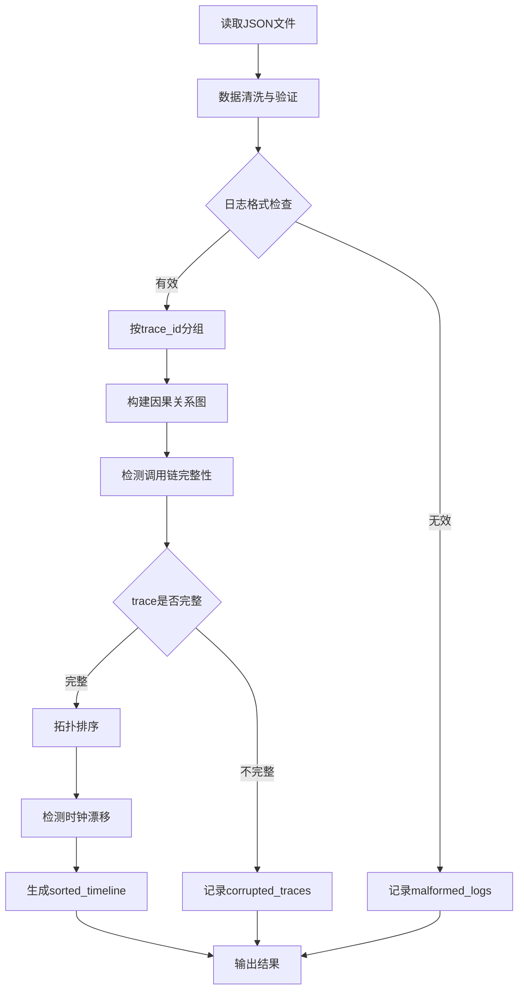

# 分布式时序重构 Python 脚本

## 数据概况

- 输入文件: [`input/input.json`](input/input.json)（约200万行，145,500条日志）
- 20个节点（00-19），最大时钟漂移阈值 5000ms
- 日志类型: INIT（开始）、PROCESS（处理）、END（结束）

## 核心处理逻辑

## 异常检测规则

| 异常类型 | 检测规则 |

|---------|---------|

| malformed_logs | 缺少必需字段 / payload非对象类型 / 字段类型错误 |

| corrupted_traces | 缺少INIT或END事件 / causal_ref引用的log_id不存在 |

| orphaned_logs | causal_ref指向不存在的log_id（全局层面） |

| clock_skew_events | 子事件的timestamp_ms早于父事件（违反因果时序） |

## 排序策略

1. **首先**按因果关系排序（拓扑排序）
2. **同层级事件**按logical_clock升序排序
3. **logical_clock相同时**按timestamp_ms排序

## 输出文件

- 路径: [`output/output.json`](output/output.json)
- `sorted_timeline`: 仅包含完整调用链中的有效日志（按因果顺序排列）
- `anomaly_report`: 异常统计报告